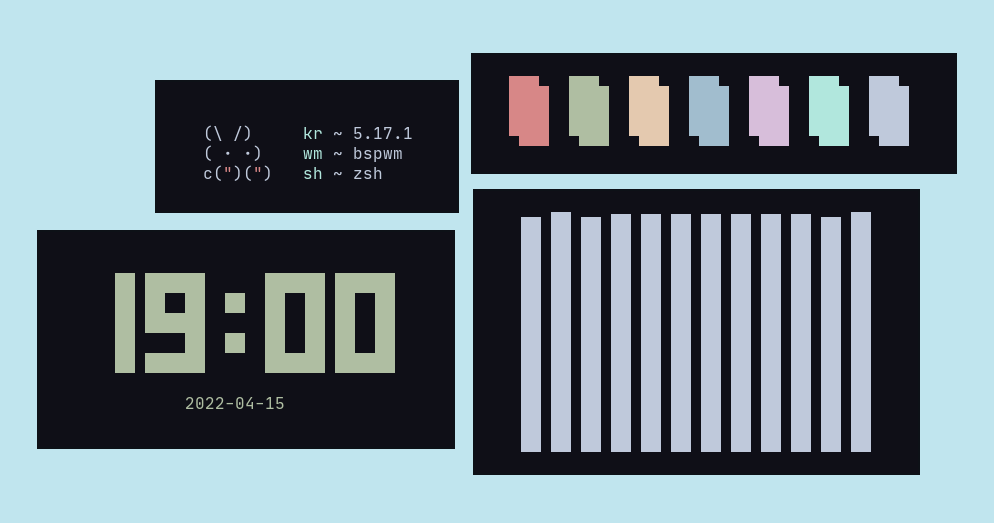

<div align="center">
    
    <h1>Levuaska for Tym</h1>
    
    <p></p>
    <a href="https://github.com/levuaska/tym/stargazers">
        
    </a>
    <a href="https://github.com/levuaska/tym/network/members/">
        
    <a href="https://github.com/levuaska/tym">
    	
    </a>
    <a href="https://github.com/levuaska/tym/blob/main/LICENSE">
    	
    </a>
</div>
<hr>

<h2>🔎 Installation</h2>
  
- Clone this repository
- Enter folder of clone
- Move `theme.lua` to `~/.config/tym/`:
```
mv theme.lua ~/.config/tym/
```
  
<h2>💜 Thanks<h2>

- [justleoo](https://github.com/justleoo)
